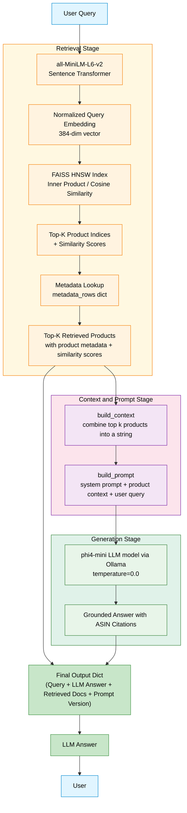

# Amazon Electronics Product Retrieval

A production-style information retrieval system built on Amazon Electronics review data. The system implements and compares three retrieval strategies: **BM25 keyword search**, **semantic vector search**, and a **hybrid approach** using Reciprocal Rank Fusion (RRF). The application surfaces results through a clean Streamlit UI modeled after the Amazon experience.

Users can search, compare methods side-by-side, and provide thumbs up/down relevance feedback that gets persisted for evaluation.

---
## RAG Pipeline Workflow 

The pipeline has three stages: **Retrieval** (semantic similarity search over FAISS), **Context & Prompt Construction** (formatting retrieved products into a structured prompt for the LLM), and **Generation** (grounded answer from phi4-mini via Ollama).



**Attribution**: Claude Sonnet 4.6 for syntax help with the Mermaid code after prompting it with the sequential steps in the RAG pipeline.

---
## Project Structure

```text
├── app/
│   └── app.py                  # Streamlit application
├── data/
│   ├── raw/                    # Raw source data (gitignored)
│   └── processed/              # Parquet corpus + cached artifacts (gitignored)
├── feedback/
│   └── user_feedback.csv       # Persisted user relevance feedback
├── notebooks/
│   └── milestone1_exploration.ipynb   # EDA and preprocessing notebook
├── results/
│   └── milestone1_discussion.md       # Qualitative evaluation write-up
├── src/
│   ├── bm25.py                 # BM25 index construction and search
│   ├── semantic.py             # FAISS index construction and semantic search
│   ├── hybrid.py               # RRF-based hybrid search
│   └── utils.py                # Tokenization, I/O, and shared utilities
└── environment.yml             # Conda environment specification
```

---

## Dataset

This project uses the `meta_Electronics.jsonl` and `Electronics.jsonl` datasets from [Amazon Reviews 2023](https://amazon-reviews-2023.github.io/), which are products from the **Electronics** category. The dataset contains product metadata and customer reviews for 18 million+ electronics products sold on Amazon.

Each document in the retrieval corpus is created by combining product metadata and review text into a single `retrieval_text` field. The following metadata columns are stored alongside each document for display:

| Field | Description |
| --- | --- |
| `parent_asin` | Unique product identifier |
| `product_title` | Full product name |
| `description` | Product description |
| `main_category` | Top-level product category |
| `store` | Brand/store name |
| `price` | Listed price |
| `average_rating` | Mean star rating |
| `rating_number` | Total number of ratings |
| `review_count` | Number of text reviews |
| `features` | Bullet-point product features |
| `categories` | Category hierarchy |
| `all_review_titles` | Concatenated review titles |
| `review_text_200` | First 200 characters of a representative review |

---

## Data Processing

All preprocessing is handled in `notebooks/milestone1_exploration.ipynb`, which outputs a `retrieval_corpus.parquet` file to `data/processed/`. The key steps are:

1. **Joining** product metadata with review text on `parent_asin`
2. **Deduplicating** by `parent_asin` to keep one representative document per product
3. **Constructing `retrieval_text`** by concatenating title, description, features, category, and review content into a single searchable string per product
4. **Writing** the resulting dataframe to Parquet for efficient lazy loading downstream

At search time, `utils.py` handles two tokenization paths:

- **Python tokenizer** (`tokenize()`) — used for short user queries: lowercases, strips non-alphanumeric characters, and removes English stop words
- **Polars vectorized tokenizer** (`polars_tokenize_expr()`) — used for bulk corpus tokenization at index build time using Polars expressions for faster tokenization speed

---

## Retrieval Workflows

### BM25 (Keyword Search)

Implemented in `src/bm25.py` using the `rank_bm25` library.

**Build path:** The corpus is loaded from Parquet in chunks, tokenized using the Polars vectorized expression, and used to construct a `BM25Okapi` index. Both the tokenized corpus and the BM25 index are persisted to disk as pickle files so they only need to be built once.

**Fast path:** On subsequent runs, `load_or_build_search_artifacts()` checks for an existing BM25 index and metadata pickle — if both exist, they are loaded directly without re-reading the corpus at all.

**Search:** The user's query is tokenized with the Python tokenizer, scored against the BM25 index with `get_scores()`, and the top-k results are selected using `np.argpartition` (avoids a full sort for speed).

### Semantic Search (Vector Search)

Implemented in `src/semantic.py` using `sentence-transformers` and `FAISS`.

**Model:** `all-MiniLM-L6-v2` — a fast, lightweight sentence embedding model that produces 384-dimensional normalized embeddings well-suited for cosine similarity search.

**Index:** FAISS `IndexHNSWFlat` with inner product metric (equivalent to cosine similarity on normalized embeddings). HNSW was chosen over `IndexFlatIP` for its approximate nearest neighbour approach, which gives substantially faster query times on large corpora with minimal recall loss.

**Build path:** The corpus is processed in chunks. Each chunk is embedded and saved to disk as a `.npy` file. Once all chunks are processed, the embeddings are added to the FAISS index and persisted as a `.index` file. Metadata rows are saved as a parallel pickle.

**Fast path:** If the FAISS index and metadata pickle both exist, they are loaded directly. If only the index is missing but the embedding chunk `.npy` files exist, the index is rebuilt from those chunks without re-embedding the entire corpus.

**Search:** The query is embedded with the same model (with `normalize_embeddings=True`), and `index.search()` returns the top-k nearest neighbours by cosine similarity.

### Hybrid Search (RRF Fusion)

Implemented in `src/hybrid.py` using Reciprocal Rank Fusion.

BM25 and semantic similarity scores live on entirely different numeric scales, so raw score fusion is not meaningful. Instead, hybrid search fuses the **rank positions** from each retrieval method using the RRF formula:

```text
hybrid_score(doc) = 1 / (k + rank_bm25(doc)) + 1 / (k + rank_semantic(doc))
```

Where `k = 60` is the standard RRF smoothing constant that dampens the influence of very high-ranked results and prevents any single method from dominating.

Each retrieval method is run with a `candidate_multiplier` (default 3×) so that more candidates are considered before fusion — this ensures documents ranked highly by one method but outside the naive top-k of the other are still captured.

Documents are then ranked by their combined hybrid score in descending order.

---

## Environment Setup

This project uses a `conda` environment. To recreate it:

First clone the repo: 

```bash
git clone https://github.com/UBC-MDS/DSCI-575-amazon-review-retrieval-jasjot-karan.git
cd DSCI-575-amazon-review-retrieval-jasjot-karan
```

Then activate the environment:

```bash
conda env create -f environment.yml
conda activate amazon-retrieval
```

Key dependencies:

| Package | Version | Purpose |
| --- | --- | --- |
| `python` | 3.12 | Core runtime |
| `polars` | 1.39.3 | Fast DataFrame processing for corpus loading |
| `faiss-cpu` | 1.8.* | Vector index for semantic search |
| `sentence-transformers` | 3.0.1 | Text embeddings |
| `rank-bm25` | 0.2.2 | BM25 implementation |
| `streamlit` | 1.36.0 | Web UI |
| `scikit-learn` | 1.5.0 | Stop words and utilities |
| `numpy` | 1.26.* | Numerical operations |

---

## Reproducing the Results

### 1. Prepare the Data

Place the raw Amazon Electronics dataset files into `data/raw/`. Then run the preprocessing notebook to generate the retrieval corpus:

```bash
jupyter notebook notebooks/milestone1_exploration.ipynb
```

This produces `data/processed/retrieval_corpus.parquet`.

### 2. Build the Search Indexes

The indexes are built automatically on first launch of the app (or by running the module scripts directly). To pre-build manually:

```bash
# Build BM25 index
python src/bm25.py

# Build FAISS semantic index
python src/semantic.py
```

Both scripts persist their artifacts to `data/processed/` so subsequent runs load instantly.

### 3. Run the App Locally

```bash
streamlit run app/app.py
```

The app will be available at `http://localhost:8501`. On first launch, it builds and caches all search artifacts automatically — subsequent loads are near-instant.

---

## User Feedback

The app includes a relevance feedback mechanism on every result card. Clicking thumbs up (relevant) or thumbs down (not relevant) appends a record to `feedback/user_feedback.csv` with the query, search type, rank, score, and product metadata. This data can be used to compute precision@k and other IR metrics offline.

---

## Qualitative Evaluation

A 30-query evaluation set (10 easy, 10 medium, 10 difficult) and a detailed comparison of BM25 vs. semantic retrieval is documented in [results/milestone1_discussion.md](results/milestone1_discussion.md).

Key findings:

- **BM25** excels on technical/factoid queries with exact measurements or brand names
- **Semantic search** excels on intent-based natural language queries describing use cases
- **Hybrid (RRF)** captures the strengths of both by rewarding documents ranked highly by either method
- Both methods degrade on complex multi-constraint queries, motivating future reranking work

## Authors

| Name | GitHub |
| --- | --- |
| Jasjot Parmar | [@jasjotp](https://github.com/jasjotp) |
| Karan Bains | [@kkaranbayns](https://github.com/karanbayns) |
